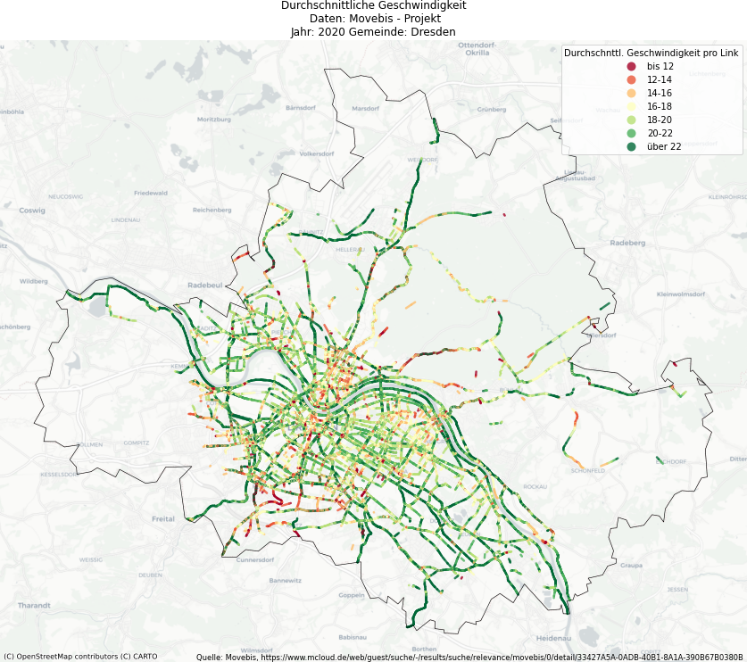

# DD Movebis

Aufbereitung und Darstellung der Radverkehrsdaten aus dem Movebis-Projekt [1].

Im Rahmen von "Stadtradeln" hat das Movebis-Projekt deutschlandweit GPS-Tracks von teilnehmenden Radfahrer'innen gesammelt. Anzahl Beobachtungen und durchschnittliche Geschwindigkeiten sind OSM-Links zugefügt worden und können nun auf mcloud [2] heruntergeladen werden.

Dieses Projekt basiert auf https://github.com/vizsim/movebis Vielen Dank für diese Inspiration.

## Anforderungen

### Movebis-Daten

Auf mcloud [2] befinden sich 3 Datensätze aus dem Movebis-Projekt: Radverkehrsmengenkarte [3], Geschwindigkeiten der Radfahrenden [4] und Heatmap Radverkehr [5]. Die Daten müssen als `tar.gz` unter `data\movebis` abgelegt werden.

Diese Daten sind unter Creative Commons Namensnennung - Nicht kommerziell (CC BY-NC) lizenziert.

### Shapefile für sächsische Gemeindegrenzen

Beim Staatsbetrieb Geobasisinformation und Vermessung Sachsen gibt es die Verwaltungsgrenzen als Shapefiles. Diese Daten sind entpackt unter `data\shapefiles` abzulegen.

### Python-Bibliotheken

Das Projekt läuft aktuell mit Python 3.8.0 und benötigt die folgenden Bibliotheken: `pandas, geopandas, numpy, shapely, matplotlib, contextily, mapclassify, folium, branca`

## Was macht es?

Das Projekt enthält 2 Jupyter Notebooks: `movebis_numbers.ipynb` und `movebis_speed.ipynb`. `movebis_numbers.ipynb` wertet die Radverkehrsmengen aus, `movebis_speed.ipynb` stellt die durchschnittlichen Geschwindigkeiten dar. 

Die Daten werden dabei auf eine der sächsichen Gemeinden gefiltert. Zusätzlich werden Strecken ignoriert, die nicht von einer bestimmten Mindestanzahl an Radlern befahren wurde. Dies filtert z.B. auch uninteressante Strecken wie Hinterhöfe raus. Damit ist die Standardkonfiguration auf Sachsen beschränkt. Zum Auswerten von anderen Teilen Deutschlands kann das Polygon, dass zum Filtern der Daten benutzt wird, mit eigenen Koordinaten überschrieben werden.

Nach dem Filtern werden die Daten als CSV-Dateien gecached. Beim nächsten Aufruf mit gleichen Parametern werden direkt die Daten aus dem Cache verwendet. Dies spart sehr viel Rechenzeit ein.

Als Ausgabe werden die Daten als statisches PNG und als HTML ausgegeben. Letzteres erlaubt ein dynamisches Zoomen auf der Karte.

## Quellen:

[1] https://www.movebis.org/

[2] https://www.mcloud.de/web/guest/suche/-/results/suche/relevance/movebis/0

[3] https://www.mcloud.de/web/guest/suche/-/results/suche/relevance/movebis/0/detail/ECF9DF02-37DC-4268-B017-A7C2CF302006

[4] https://www.mcloud.de/web/guest/suche/-/results/suche/relevance/movebis/0/detail/33427A5A-0ADB-40B1-8A1A-390B67B0380B

[5] https://www.mcloud.de/web/guest/suche/-/results/suche/relevance/movebis/0/detail/3096DB7A-9EE4-4C14-B2AA-79E33A7FFF01

[6] https://www.geodaten.sachsen.de/downloadbereich-verwaltungsgrenzen-4344.html